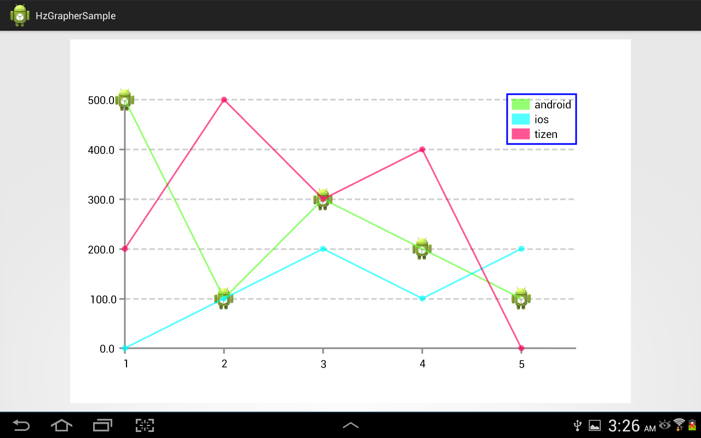
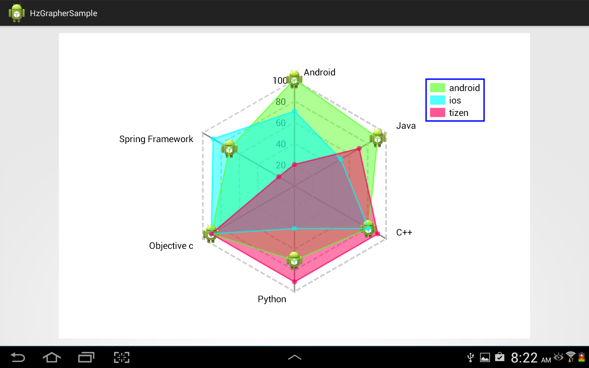
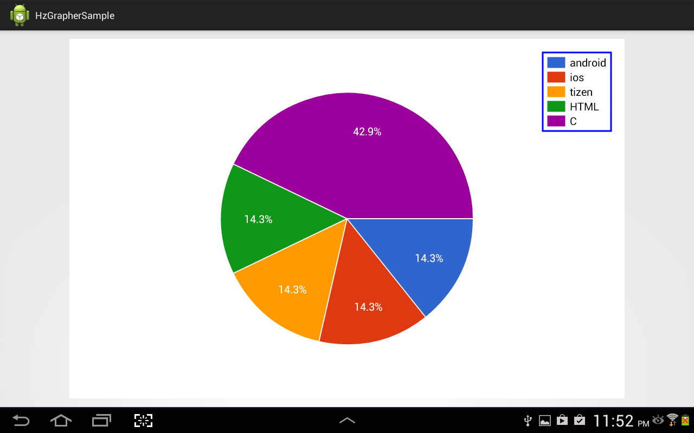
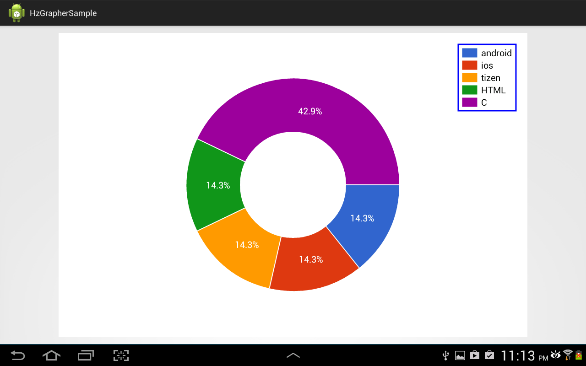
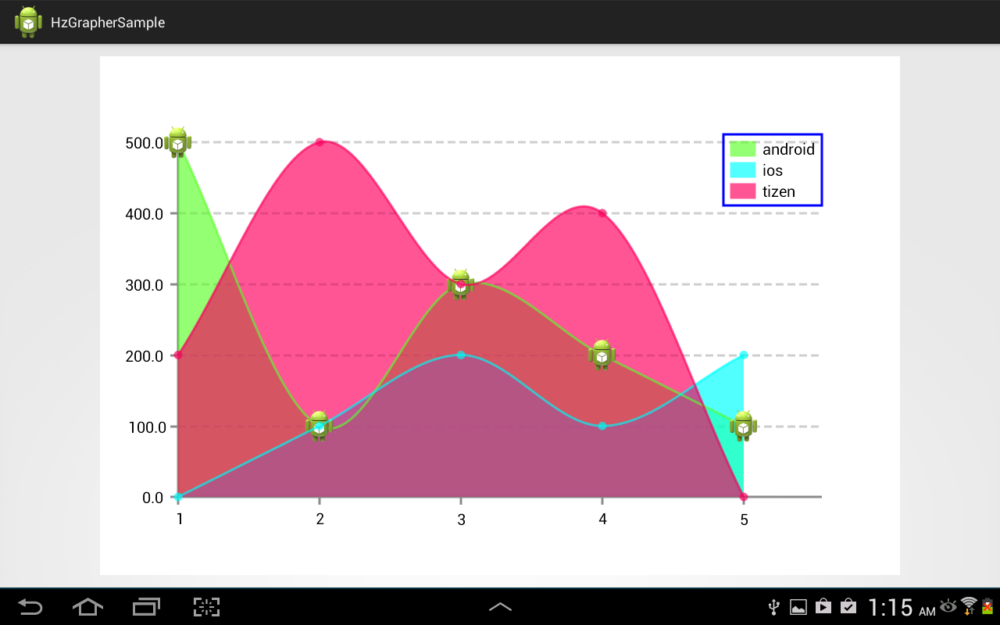
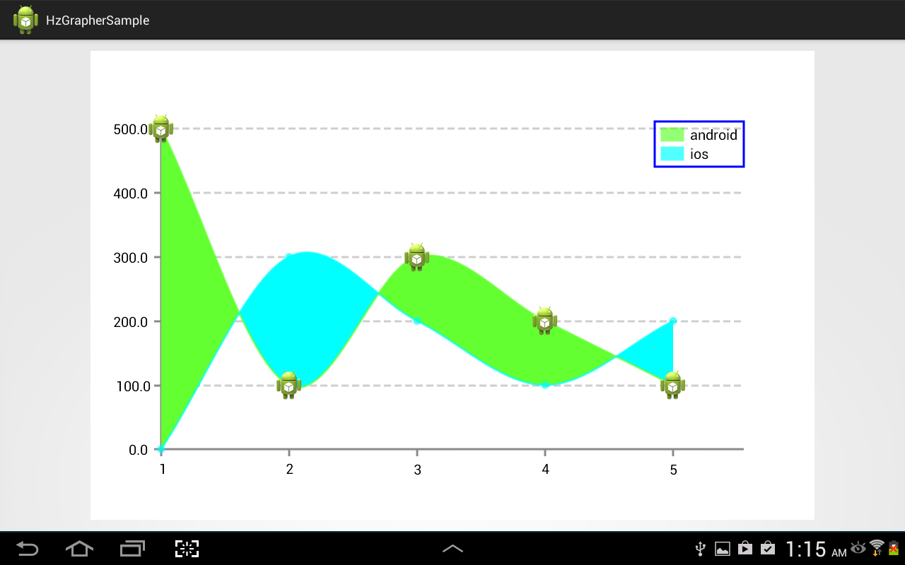
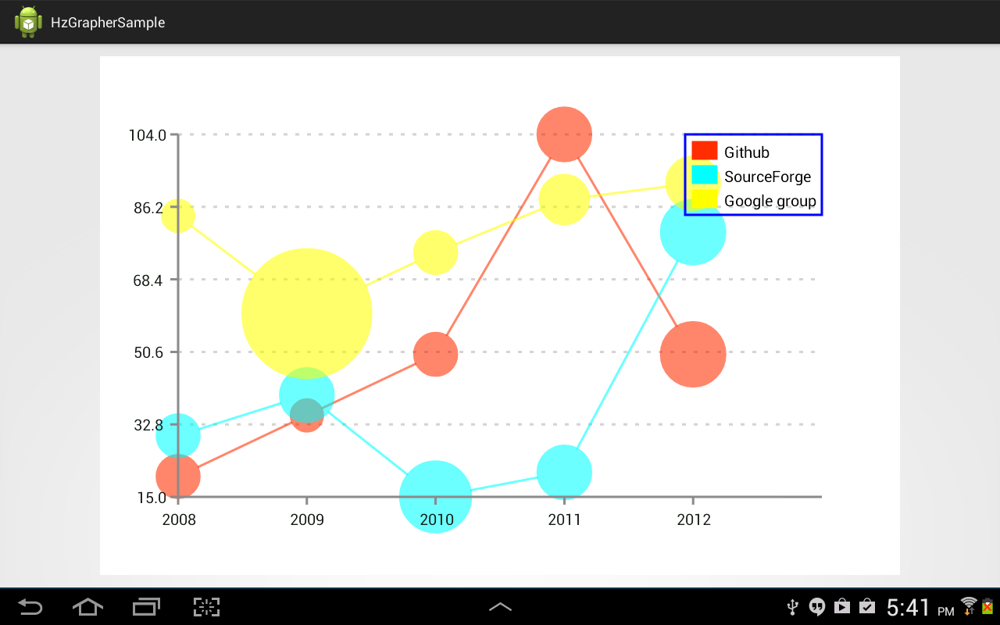
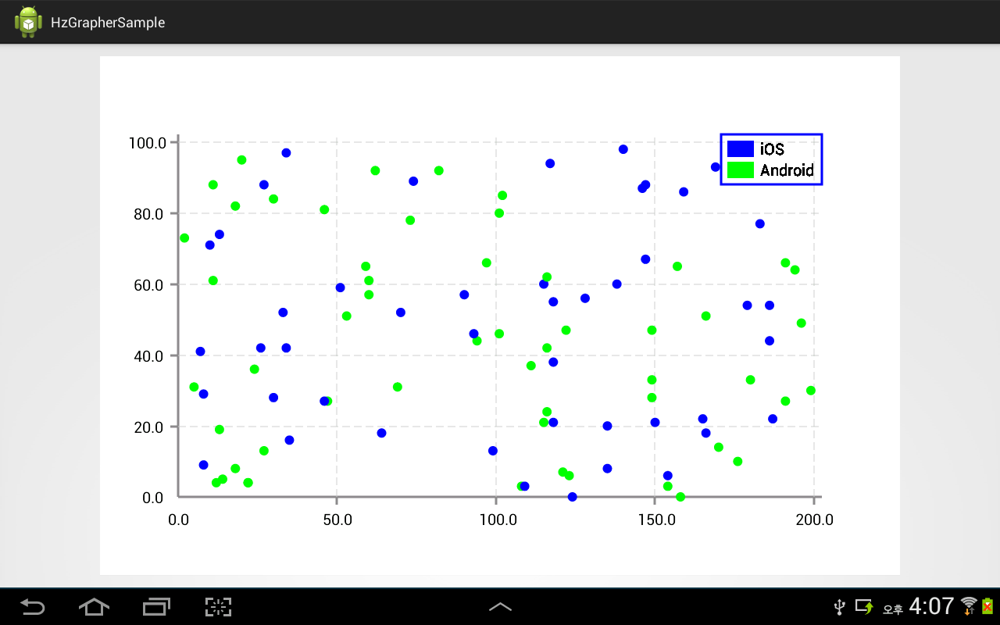

HzGrapher
=========

android hz graph library

Release
-------
v1.0.0 - https://github.com/handstudio/HzGrapher/tree/master/release/v1.0.0

Function
--------
+ Line Graph


+ Line Graph with Region


+ Line Compare Graph


+ Radar Graph


+ Circle Graph


+ Pie Graph


+ Curve Graph


+ Curve Graph with Region


+ Curve Compare Graph


+ Bubble Graph


+ Scatter Graph


Feature
-------
+ easy to customize
+ free of layout size
+ graph draw animation


Usage
-----

### Gradle build

To install the sample application to your device run the following task:

```bash
$ ./gradlew installDebug
```

To deploy the library to your local Maven repository run the following task:

```bash
$ ./gradlew install
```

Then, to use the library in your project add the following to your `build.gradle`:

```groovy
dependencies {
    compile 'com.handstudio.android:hzgrapherlib:1.0.0'
}
```
